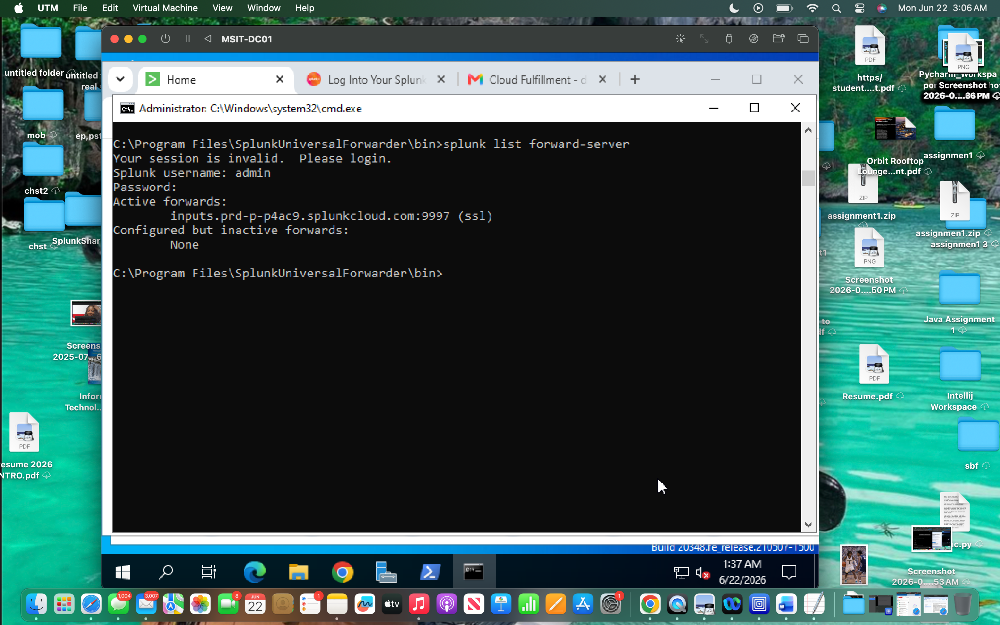
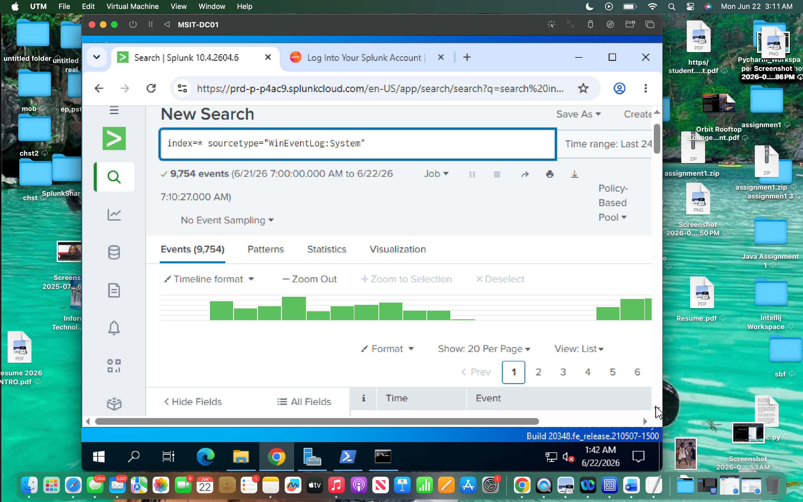
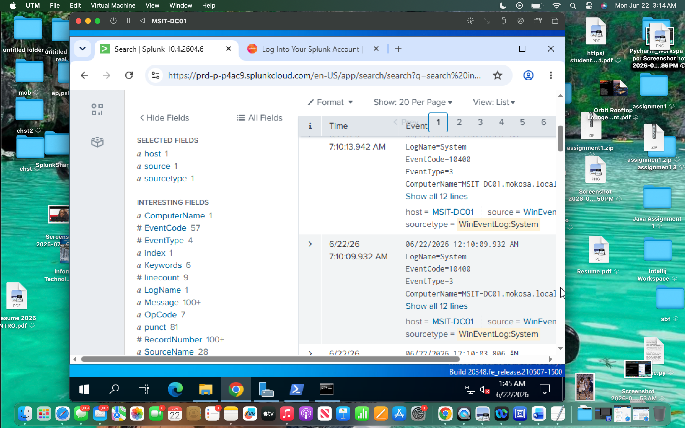
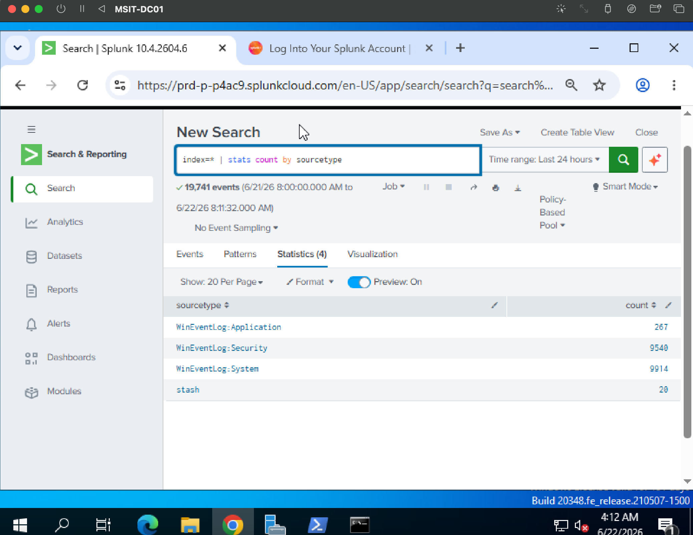
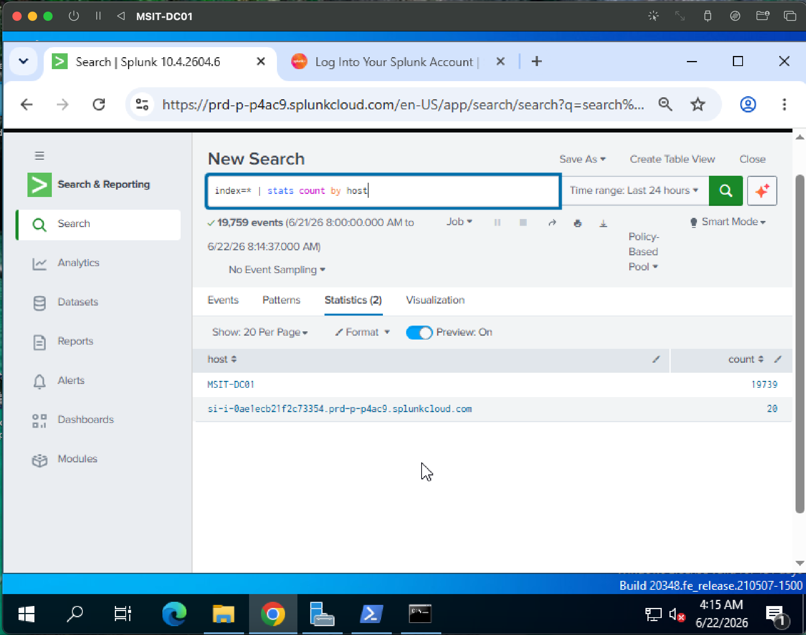
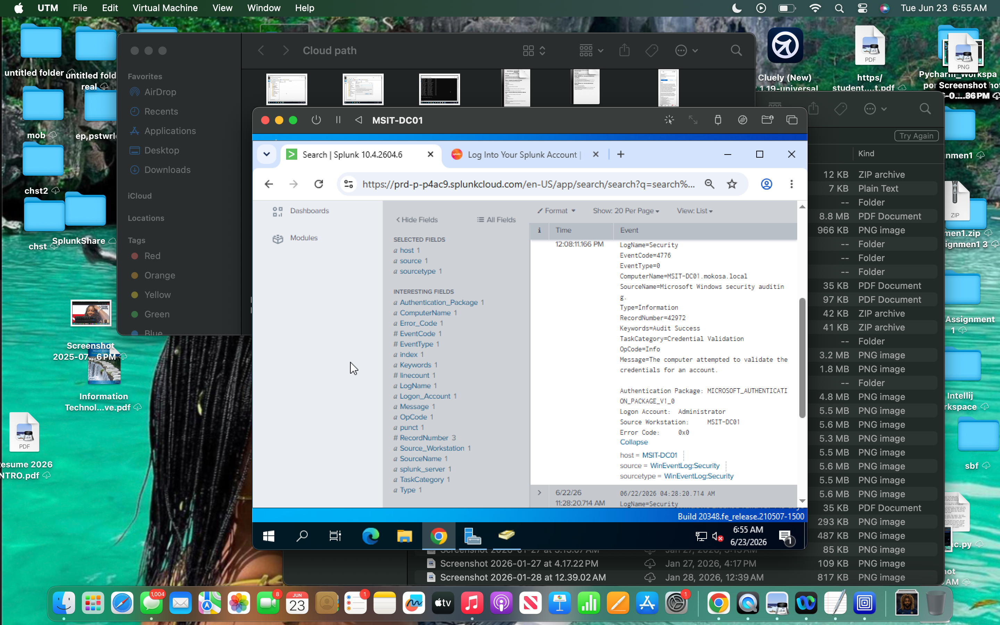
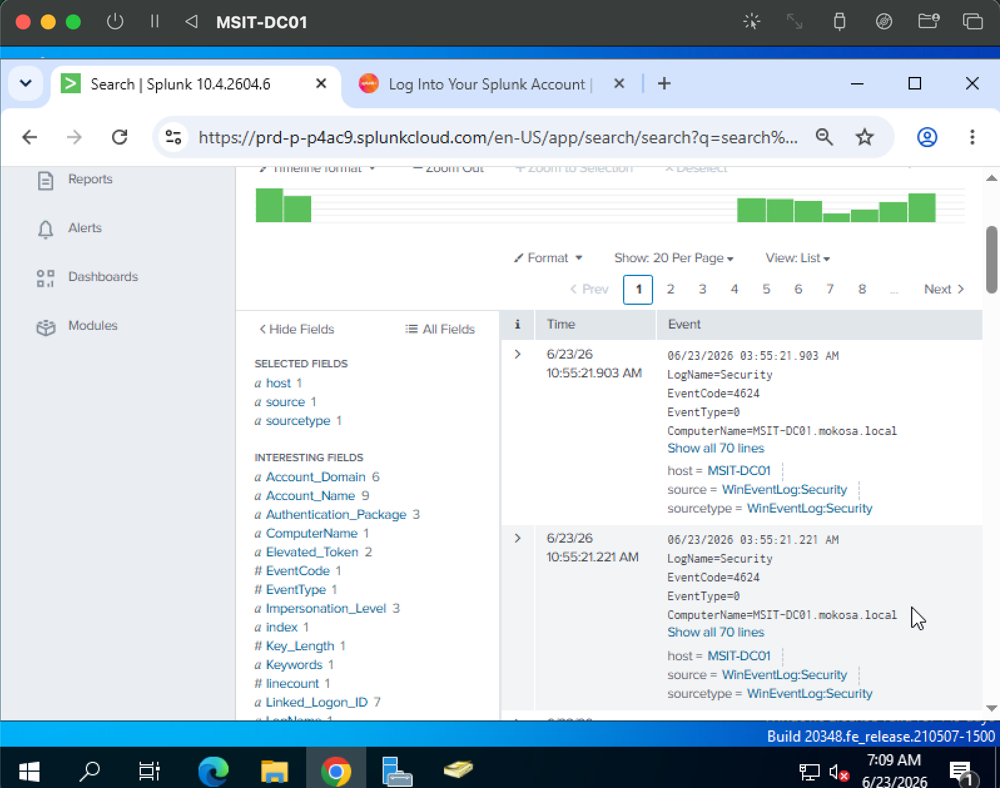
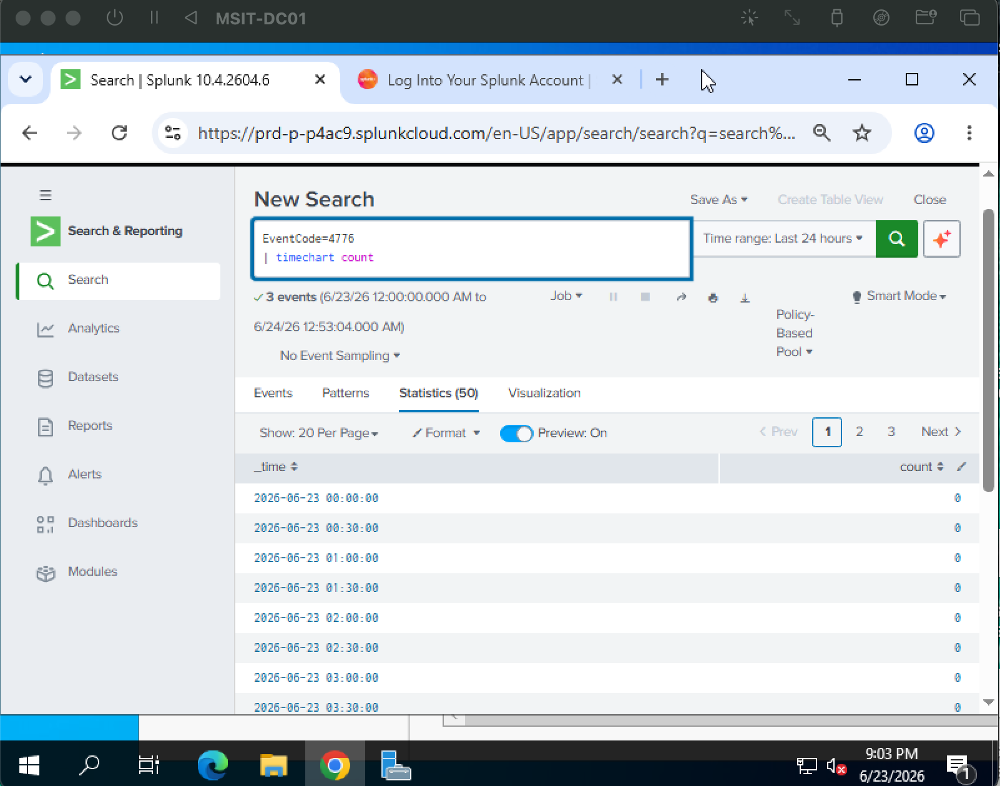

# Splunk Active Directory Security Monitoring Lab

## Overview

This project demonstrates the deployment of a Splunk-based security monitoring environment within a Windows Active Directory domain.

A Splunk Universal Forwarder was configured on a Windows Server domain controller to securely forward Windows event logs into Splunk Cloud for centralized log analysis and security monitoring.

The environment was used to collect and analyze Windows Security, System, Application, and PowerShell logs, monitor Active Directory authentication activity, create detections, investigate security events, develop dashboards, and automate reporting workflows.

### Technologies Used

#### Infrastructure

- Windows Server
- Active Directory Domain Services (AD DS)
- Domain Controller (MSIT-DC01)

#### SIEM & Monitoring

- Splunk Cloud
- Splunk Universal Forwarder
- Splunk Search Processing Language (SPL)

#### Log Sources

- Windows Security Logs
- Windows System Logs
- Windows Application Logs
- Windows PowerShell Logs

#### Security Use Cases

- Authentication Monitoring
- Failed Logon Detection
- Account Lockout Monitoring
- Privileged Group Change Detection
- Security Event Investigation
- Dashboard Development
- Detection Engineering

#### Reporting & Automation

- PowerShell
- CSV Reporting
- Automated Security Reporting

### Project Objectives

- Deploy Splunk Cloud and configure log forwarding
- Validate Windows event log ingestion
- Monitor Active Directory authentication events
- Create security detections and saved searches
- Build operational security dashboards
- Investigate security-relevant events
- Generate automated security reports

---
## Phase 1 — Environment Setup

Deployed a Splunk Cloud security monitoring environment and configured a Splunk Universal Forwarder on a Windows Server domain controller. The forwarder was connected to Splunk Cloud using the Splunk Cloud Universal Forwarder credentials package and verified through an active SSL forwarding connection on port 9997.

Windows Event Logs were successfully ingested into Splunk Cloud from the domain controller host `MSIT-DC01`, confirming that the log pipeline was operational.

**Evidence Captured:**
- Universal Forwarder active forwarding connection
- Windows System event logs received in Splunk Cloud
- Host, source, and sourcetype validation for `MSIT-DC01`

### Screenshots

#### Universal Forwarder Connected to Splunk Cloud

#### Windows System Events Successfully Ingested

## Phase 2 — Log Ingestion Validation

Validated Windows event log ingestion into Splunk Cloud by confirming that events were being received from the domain controller and properly categorized by Splunk sourcetype. Searches were performed to verify active log collection and confirm host attribution for future monitoring and detection use cases.

### Evidence Captured

- Validated Windows event log ingestion into Splunk Cloud
- Verified event parsing through Splunk sourcetypes
- Confirmed host attribution for collected events
- Confirmed event collection from domain controller `MSIT-DC01`
- 
### Events by Sourcetype

### Events by Host

## Phase 3 — Active Directory Authentication Monitoring

Monitored Active Directory authentication activity through Splunk Cloud by generating and analyzing successful logons, failed logons, and account lockout events. Authentication-related event IDs were investigated to validate security visibility and establish a foundation for detection engineering and incident response workflows.

### Evidence Captured

- Successful logon monitoring (Event ID 4624)
- Failed Authentication Activity (4776)
-  Credential Validation Activity
- Authentication event investigation through Splunk search
- Active Directory security event visibility validation

### Failed Authentication Activity (4776)

### Successful Logon Activity (4624)

### Credential Validation Activity

## Phase 4 — Detection Engineering

Developed security detections within Splunk Cloud to identify authentication anomalies and privileged account activity within the Active Directory environment. Saved searches were created to monitor failed logons, account lockouts, and privileged group membership changes.

### Evidence Captured

- Created failed logon detection for authentication monitoring
- Created account lockout detection for account abuse identification
- Created privileged group change detection for elevated access monitoring
- Established reusable detections for future alerting workflows

### Failed Logon Detection

### Account Lockout Detection

### Privileged Group Change Detection

## Phase 5 — Security Dashboard Development

Developed a centralized Active Directory security monitoring dashboard within Splunk Cloud to visualize authentication activity, failed logons, account lockouts, and high-frequency Windows security events. Dashboard panels were created to support rapid investigation and security monitoring workflows.

### Evidence Captured

- Created centralized Active Directory monitoring dashboard
- Visualized successful authentication activity
- Visualized failed authentication activity
- Visualized account lockout events
- Identified high-frequency Windows security event codes
- Established analyst-friendly monitoring views

### Active Directory Security Monitoring Dashboard

### Authentication Activity Panel

### Failed Logons Panel

### Account Lockouts Panel

### Top Event Codes Panel

## Phase 6 — Automated Security Reporting

Developed a PowerShell-based reporting workflow to automate extraction of Windows security events for reporting and analysis.

Authentication-related events were exported from the Windows Security log into CSV format, demonstrating basic security reporting and automation capabilities.

### Evidence Captured

- PowerShell security reporting script execution
- Automated CSV report generation
- Export of Windows Security event data
- Basic reporting automation workflow

### PowerShell Report Generation

### Generated CSV Report

### CSV Report Contents

